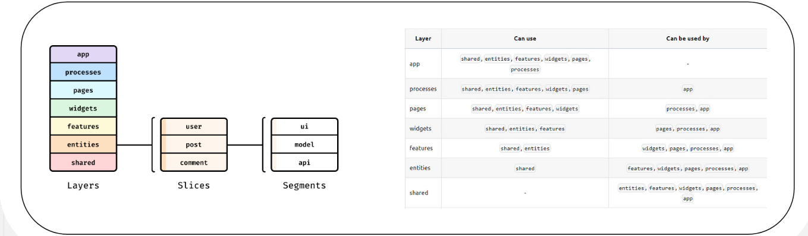

# Архитектура проекта

├── app/
| # Слой композиции приложения
| # Содержит только абстрактную логику инициализации и маршрутизации по приложению
| ├──router/
| | ├──Router
| # Содержит в себе логику маршрутизации
| ├──App
| # Содержит в себе обёртку для маршрутизации по приложению
|
├── pages/
| # Срезы, реализующие полные представления для этого приложения
| ├── LandingPage
| # Срез, содержащий в себе полное представление страницы для неавторизованных пользователей
| ├── AuthPage
| # Срез, содержащий в себе полное представление страницы для авторизации пользователя
| ├── UserPage
| # Срез, содержащий в себе полное представление страницы личного кабинета пользователя с функциями "Менджемента полей" и "Получения рекомендаций"
|
├── widgets/
| # Срезы, реализующие различные комбинации абстрактных и/или бизнес-блоков с нижележащих слоёв,
| # для предоставления изолированных атомарных фрагментов пользовательского интерфейса
| ├── Login
| ├── Registration
| ├── Sidebar
| ├── Header
| ├── ActionField
|
├── features/
| # Срезы, реализующие пользовательские сценарии; обычно здесь приходится оперировать бизнес-объектами
| ├── CreateUser
| ├── SignIn
| ├── FieldExecutor
| ├── GetRecomendation
| ├── ToastExecutor
| ├── FetchHttpClient
|
├── entities/
| # Срезы, реализующие бизнес-блоки в терминах того, какая бизнес-логика приложения сработает
| ├── FieldInfo/
| | ├── ui/
| | # Содержит в себе UI-компоненты, применяемые только для этого компонента
| | ├── model/
| | # Содержит в себе сущности логики компонента
| | ├── api/
| | # Содержит в себе методы для взаимодествия с API
| | ├── index
| | # Срез, всех абстрактных блоков, находящихся в слайсе
| ├── Recomendation
| | ├── ui/
| | ├── model/
| | ├── api/
| | ├── index
| ├── ToastWrapper
| | ├── ui/
| | ├── model/
| | ├── api/
| | ├── index
|
├── shared/
| # Этот слой – набор абстрактных сегментов и общепереиспользуемых элементов
| # Это означает, что на нём недопустимы какие-либо ui-элементы, кастомные библиотеки и любые блоки переиспользуемые по всему проекту

## Правила нейминга в коде 

|   CamelCase   |           |          PascalCase           |           |                   KebabCase                   |           *Хуки называть по правилам React;
|               |           |                               |           |                                               |
|   Переменные  |           |   Функциональные компоненты   |           |       переменные конфигурационных файлов      |
|   Методы      |           |            Классы             |           |                                               |
|   Функции     |           |                               |           |                                               |

## Правила неминга в файловой системе

|   CamelCase   |           |          PascalCase           |           *Хуки называть по правилам React;
|               |           |                               |           
|     слои      |           |   Функциональные компоненты   |
|    слайсы     |           |            Классы             |
|   сегменты    |           |                               |

## Шпаргалка по использованию FSD

## Внешние зависимости

### Маршрутизация проекта
- React-router

### Стилизация проекта
- TailwindCSS

### Библиотеки для разработки собственной бибилиотеки UI-компонентов (Typescript)
- Material-UI
- Zod (Валидация форм)
- react-hook-form (Для обработки событий и взаимодействия с формами)

### Библиотеки для тестирования компонентов
- Storybook
- Jest

### Библиотеки для сборки проекта
- Vite

### CI/CD библиотеки
- nodemon
- Prettier
- Eslint

## Скрипты для запуска и тестирования
- npm run dev (запуск в режиме разработчика)
- npm run build (cборка приложения)
- npm run test (запуск jest-тестов)